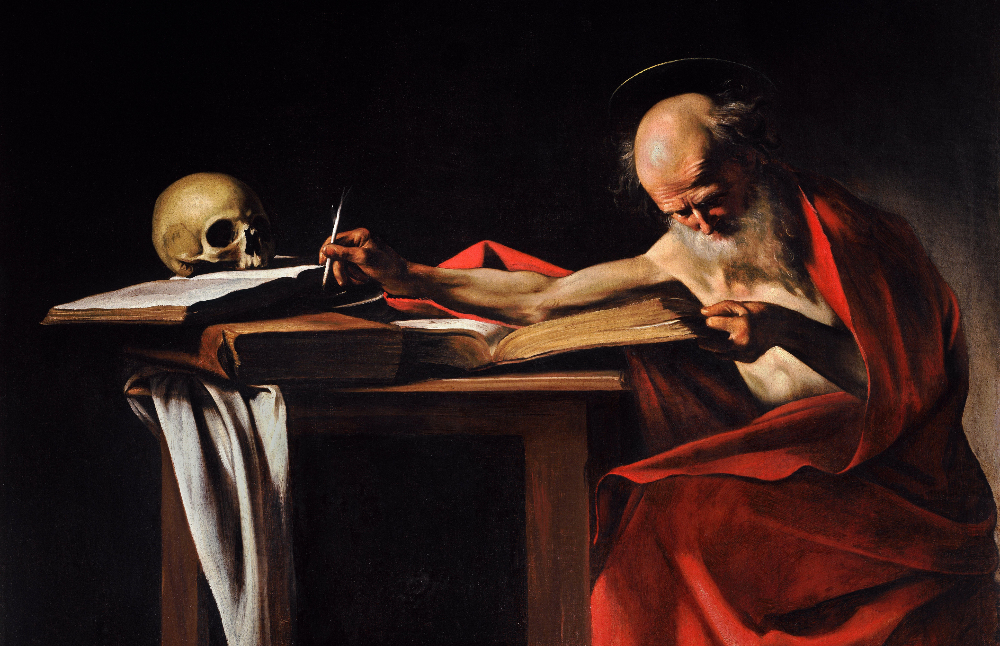
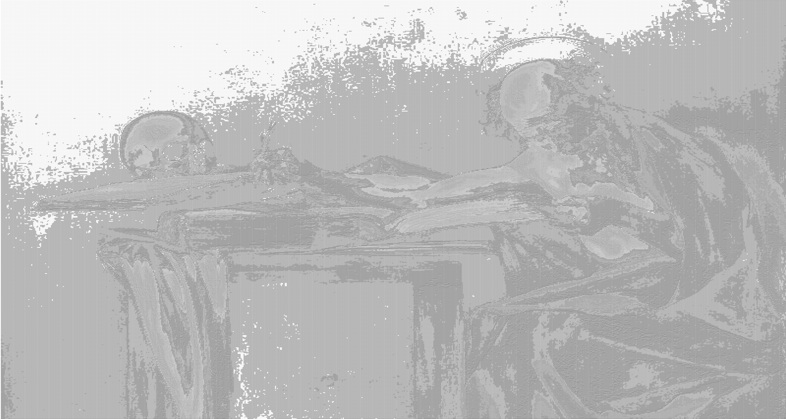

# ASCIIArt

A CLI tool for converting JPG images into text files displaying the image as ASCII art.

## Usage

Navigate to the gem folder in the CLI.

You can run `ruby lib/ascii_art.rb --h` to display instructions on what flags to use.

To convert an image, run `ruby lib/ascii_art.rb -p images/caravaggio.jpg` which will use the default `average` method to calcuate the brightness of each pixel.

This will output a text file containing a drawing of the image using ASCII.

When opening the text file in a text editor, it will open as "zoomed in" so it is important to change the font size to the lowest size to see the image in full.

An example of an original image:

#### Average

Converted using the `average` method:

Because ASCII characters are not perfectly square, as in not of equal width and height, the proportion of the ASCII image will not be exactly the same as the original image.

#### Specifying Brightness Method

To designate a specific averaging method, add the `-a` flag after the path name with an integer ranging from `1` to `3`. If one is not specified, it will default to `average` which is the value `1`. 

#### Lightness

`ruby lib/ascii_art.rb -p images/caravaggio.jpg -a 2` will use the `lightness` method, which takes the smallest and largest RGB value of each pixel and averages it to get a brightness value:

#### Luminance

`ruby lib/ascii_art.rb -p images/caravaggio.jpg -a 3` will use the `luminance` method, which gets a weighted average of each RGB color. Due to human eyes being most sensitive to green light, followed by red, and then blue, an equally weighted average would not be accurate, so converting each RGB value using the formula: 0.299R + 0.587G + 0.114B / 3 will give a weighted average.

## Contributing

Bug reports and pull requests are welcome on GitHub at https://github.com/philiptimofeyev/ascii_art

